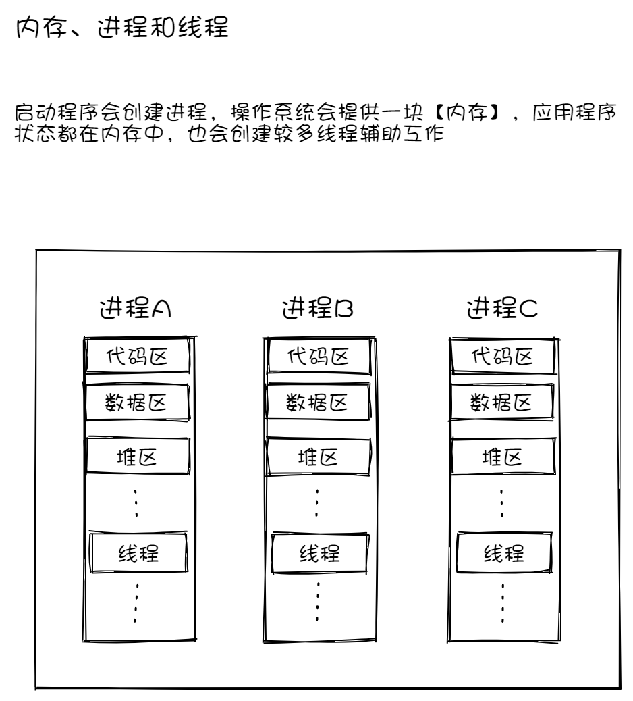
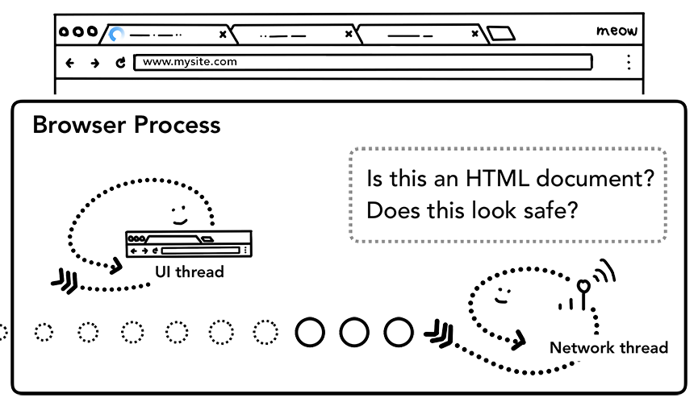
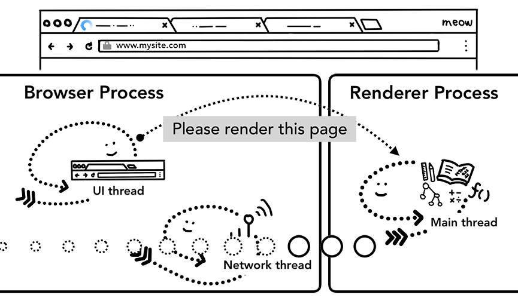
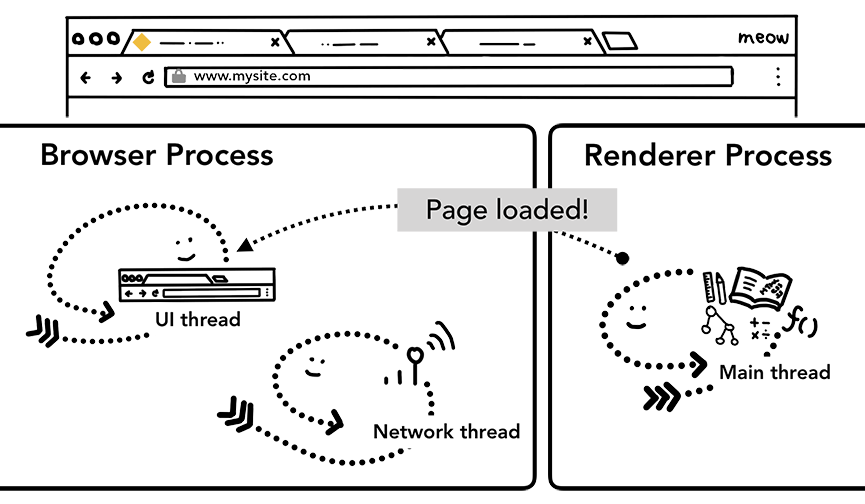
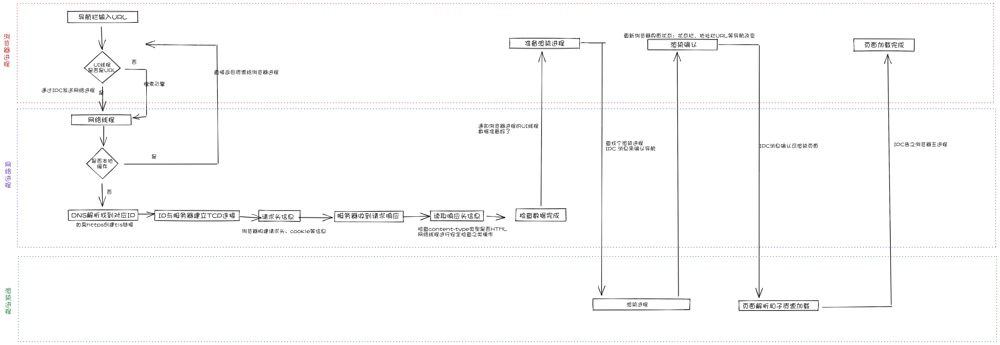

# 浏览器工作原理和V8引擎

## 目录

- [浏览器工作原理和V8引擎](#浏览器工作原理和v8引擎)
  - [目录](#目录)
  - [语言特性](#语言特性)
  - [浏览器发展史](#浏览器发展史)
    - [**第一浏览器大战**](#第一浏览器大战)
    - [第二次浏览器大战](#第二次浏览器大战)
    - [**2010年到现在**](#2010年到现在)
    - [**js语言发展**](#js语言发展)
  - [CPU、GPU、内存和多进程](#cpugpu内存和多进程)
    - [**CPU**](#cpu)
    - [**GPU**](#gpu)
    - [启动程序](#启动程序)
    - [运行程序](#运行程序)
  - [浏览器架构](#浏览器架构)
    - [单进程浏览器](#单进程浏览器)
    - [多进程浏览器](#多进程浏览器)
    - [**渲染进程中的线程**](#渲染进程中的线程)
  - [导航时候发生了什么？](#导航时候发生了什么)
      - [ 处理输入](#-处理输入)
      - [开始导航](#开始导航)
      - [读取响应](#读取响应)
    - [渲染进程来绘制⻚面](#渲染进程来绘制面)
    - [确认导航](#确认导航)
    - [加载完成](#加载完成)
    - [额外的步骤：初始加载完毕](#额外的步骤初始加载完毕)
  - [渲染过程 ](#渲染过程-)
    - [步骤](#步骤)
  - [V8引擎](#v8引擎)
      - [**为什么需要js引擎**](#为什么需要js引擎)
      - [**常见的js引擎**](#常见的js引擎)
      - [**webkit内核**](#webkit内核)
      - [**V8引擎**](#v8引擎-1)


## 语言特性

-   机器语言 01011001指令
-   汇编语言 助记符代替指令
-   高级语言 Java c c++ JavaScript


## 浏览器发展史

-   1990年 蒂姆.伯纳斯李发明 world wide web 浏览器，[http://info.cern.ch](http://info.cern.ch "http://info.cern.ch")

### **第一浏览器大战**

-   1993年网景公司，马克安德森和同事开发mosaic浏览器后改名Netscape浏览器，用户广泛使用。
    -   1995年5月livescript诞生，第一个js脚本。
    -   1995年12月网景与sun（Java语音所有者）合作，明明为JavaScript。
-   1996年微软退出IE浏览器捆绑windows操作系统，网景浏览器被挤出市场。
-   1996年网景提交源码内核给国际标准组织ECMA抵抗微软。
    -   1997年ECMA发布标准文件第一版，规定浏览器脚本语言标准并将语言称为ECMAScript。
    -   1998年美国在线公司收购网景业务，gecko内核开放源码。
    -   2003年解散网景，停止开发浏览器。
    -   2001年微软退出windows XP内置IE6，js引擎抽离出来。

### 第二次浏览器大战

-   1998年网景成立Mozilla基金会，基于gecko内核准备开发新的浏览器
-   2003年苹果公司基于KHTML引擎开发出webkit内核浏览器Safari。
-   2004年Mozilla发布全新浏览器Firefox。
-   2005年苹果开源webkit内核。
-   2008年谷歌基于苹果的webkit内核开发chromium内核的Chrome浏览器，推出v8引擎，nodejs基于v8得到发展，前端工程化发展的开端。

Mozilla的火狐、Chrome、IE浏览器三足鼎立。

### **2010年到现在**

-   2013年谷歌与webkit分离，基于chromium项目开发blink引擎。
-   2015年window10发布，微软推出全新浏览器Microsoft Edge取代IE。
-   2017年Mozilla全新的打造的 [Quantum](https://link.juejin.cn/?target=https://en.wikipedia.org/wiki/Quantum_\(Mozilla\) "Quantum") 版本
-   目前Chrome占据绝对优势。

### **js语言发展**

-   1995年Brendan Eich只用了10天完成语言设计，语法来源
    1.  基本语法：借鉴 C 语言和 Java 语言。
    2.  数据结构：借鉴 Java 语言，包括将值分成原始值和对象两大类。
    3.  函数的用法：借鉴 Scheme 语言和 Awk 语言，将函数当作第一等公民，并引入闭包。
    4.  原型继承模型：借鉴 Self 语言（Smalltalk 的一种变种）。
    5.  正则表达式：借鉴 Perl 语言。
    6.  字符串和数组处理：借鉴 Python 语言。
-   1997年7月，ECMAScript 1.0发布
-   1998年6月，ECMAScript 2.0版发布。
-   1999年12月，ECMAScript 3.0版发布，成为 JavaScript 的通行标准，得到了广泛支持。
-   2009年12月，ECMAScript 5.0版 正式发布。
-   2015年6月，ECMAScript 6 正式发布，并且更名为“ECMAScript 2015”。
-   TC39委员会计划每年发布一个版本，命名按照ECMAScript年份。


## CPU、GPU、内存和多进程

为了了解浏览器运行的环境，我们需要了解几个计算机部件以及它们的作用。

### **CPU**

**中央处理器（Central Processing Unit）**，或简称为 **CPU**。CPU 可以看作是计算机的大脑。一个 CPU 核心如图中的办公人员，可以逐一解决很多不同任务。


4 个 CPU 核心作为办公人员，坐在办公桌前处理各自的工作

### **GPU**

**图形处理器**（**Graphics Processing Unit**，简称为 **GPU**）是计算机的另一部件。与 CPU 不同，GPU 擅长同时处理跨内核的简单任务。顾名思义，它最初是为解决图形而开发的。


&#x20;                        许多带特定扳手的 GPU 内核意味着它们只能处理有限任务

### 启动程序

当你在电脑或手机上启动应用时，是 CPU 和 GPU 为应用供能。通常情况下应用是通过操作系统提供的机制在 CPU 和 GPU 上运行。


&#x20;                    三层计算机体系结构。底部是机器硬件，中间是操作系统，顶部是应用程序。

### 运行程序


&#x20;                                              进程作为边界框，线程作为抽象鱼在进程中游动

进程可以被描述为是一个应用的执行程序。线程存在于进程并执行程序任意部分。

启动应用时会创建一个进程。程序也许会创建一个或多个线程来帮助它工作，这是可选的。操作系统为进程提供了一个可以使用的“一块”内存，所有应用程序状态都保存在该私有内存空间中。关闭应用程序时，相应的进程也会消失，操作系统会释放内存


换种说法：进程可以类比为工厂，线程就是工厂里面的工人，一个工厂可以包含一个或者多个工人，工人之间可以相互协作，并且共享工作空间

进程可以请求操作系统启动另一个进程来执行不同的任务。此时，内存中的不同部分会分给新进程。如果两个进程需要对话，他们可以通过**进程间通信**（**IPC**）来进行。许多应用都是这样设计的，所以如果一个工作进程失去响应，该进程就可以在不停止应用程序不同部分的其他进程运行的情况下重新启动。


&#x20;                                独立进程通过 IPC 通信示意图

-   下面一图看下内存、进程和线程



## 浏览器架构

### 单进程浏览器

-   不稳定
    -   其中一个线程卡死，可能会导致整个程序出问题，比如打开多个标签页，其中一个标签页卡死可能会导致整个浏览器无法正常运行
    -   码或插件崩溃导致整个浏览器崩溃
-   不流畅
    -   浏览器一个进程里是可以共享数据的，那JS线程岂不是可以随意访问浏览器进程内的所有数据，这显然不合理
    -   比如内存泄漏整个浏览器卡死，不管是不是当前tab页面。
-   不安全
    -   一个进程需要负责太多事情，会导致运行效率问题
    -   一个运行页面，插件携带病毒，泄漏账号密码，没有隔离。

### 多进程浏览器

-   浏览器进程
    -   &#x20;负责控制浏览器除标签页外的界面，包括地址栏、书签、前进后退按钮等，以及负责与其他进程的协调工作，同时提供存储功能
-   GPU进程
    -   责整个浏览器界面的渲染。Chrome刚开始发布的时候是没有GPU进程的，而使用GPU的初衷是为了实现3D CSS效果，只是后面网页、Chrome的UI界面都用GPU来绘制，这使GPU成为浏览器普遍的需求，最后Chrome在多进程架构上也引入了GPU进程
-   网络进程
    -   负责发起和接受网络请求，以前是作为模块运行在浏览器进程一时在面的，后面才独立出来，成为一个单独的进程
-   插件进程
    -   主要是负责插件的运行，因为插件可能崩溃，所以需要通过插件进程来隔离，以保证插件崩溃也不会对浏览器和页面造成影响
-   渲染进程
    -   负责控制显示tab标签页内的所有内容，核心任务是将HTML、CSS、JS转为用户可以与之交互的网页，排版引擎Blink和JS引擎V8都是运行在该进程中，默认情况下Chrome会为每个Tab标签页创建一个渲染进程


&#x20;                                                          不同进程指向浏览器 UI 的不同部分


-   优点：
    -   某一渲染进程出问题不会影响其他进程
    -   为安全，在系统层面上限定了不同进程的权限
-   缺点：
    -   由于不同进程间的内存不共享，不同进程的内存常常需要包含相同的内容。

### **渲染进程中的线程**

-   GUI渲染线程
    -   负责渲染页面，解析html和CSS、构建DOM树、CSSOM树、渲染树、和绘制页面，重绘重排也是在该线程执行
-   JS引擎线程
    -   一个tab页中只有一个JS引擎线程(单线程)，负责解析和执行JS。它GUI渲染进程不能同时执行，只能一个一个来，如果JS执行过长就会导致阻塞掉帧
-   计时器线程
    -   指setInterval和setTimeout，因为JS引擎是单线程的，所以如果处于阻塞状态，那么计时器就会不准了，所以需要单独的线程来负责计时器工作
-   异步http请求线程
    -   XMLHttpRequest连接后浏览器开的一个线程，比如请求有回调函数，异步线程就会将回调函数加入事件队列，等待JS引擎空闲执行
-   事件触发线程
    -   主要用来控制事件循环，比如JS执行遇到计时器，AJAX异步请求等，就会将对应任务添加到事件触发线程中，在对应事件符合触发条件触发时，就把事件添加到待处理队列的队尾，等JS引擎处理

## 导航时候发生了什么？

#### &#x20;处理输入

-   UI线程判断用户输入的是URL还是查询


#### 开始导航

-   当用戶按下回⻋键的时候，UI线程会通知网络进程初始化一个网络请求来获取站点的内容。 这时候tab上的icon会展示一个提示资源正在加载中的旋转圈圈，而且网络进程会进行一系列诸如DNS寻址以及为请求建立TLS连接的操作。
    > 这时如果网络进程收到服务器的HTTP 301重定向响应，它就会告知UI线程进行重定向然后它会再次发起一个新的网络请求。


#### 读取响应

-   响应类型判断
    -   网络进程在收到HTTP响应的主体时，在必要的情况下它会先检查一下流的前几个字节以确定响应主体的具体媒体类型(MIME Type)。 响应主体的媒体类型一般可以通过HTTP头部的Content-Type来确定，不过Content-Type有时候会缺失或者是错误的，这种情况下浏览器就要进行MIME类型嗅探来确定响应类型了。 这里可以打开一个窗口, 看一下Content-type响应头


-   不同响应类型的处理
    -   如果响应的主体是一个HTML文件，浏览器会将获取的响应数据交给渲染进程(renderer process) 来进行下一步的工作。如果拿到的响应数据是一个压缩文件(zip file)或者其他类型的文件，响应数据就会交给下载管理器 (download manager)来处理。



-   安全检查

    网络进程在把内容交给渲染进程之前还会对内容做SafeBrowsing检查。

    如果请求的域名或者响应的内容和某个已知的病毒网站相匹配，网络进程会给用戶展示一个警告的⻚面。除此之外，网络进程还会做CORB(Cross Origin Read Blocking)检查来确定那些敏感的跨站数据.

### 渲染进程来绘制⻚面

在网络进程做完所有的检查后并且能够确定浏览器应该导航到该请求的站点，它就会告诉UI线程所 有的数据都已经被准备好了。

UI线程在收到网络进程的确认后会为这个网站寻找一个渲染进程(renderer process)来渲染界面。

因为网络请求的耗时可能会很⻓, 所以第二步中当UI线程发送URL链接给网络进程后，它其实已经知 晓它们要被导航到哪个站点了。

所以在网络进程干活的时候，UI线程会主动地为这个网络请求启动一个渲染线程。如果一切顺利的话(没有重定向之类的东西出现)，网络进程准备好数据后⻚面的渲染进程已经就准备好了，这就 节省了新建渲染进程的时间。

不过如果发生诸如网站被重定向到不同站点的情况，刚刚那个渲染进程就不能被使用了，它会被摒弃，一个新的渲染进程会被启动。


### 确认导航

&#x20;到这一步的时候，数据和渲染进程都已经准备好了，浏览器进程(browser process)会通过IPC告诉渲染进程去提交本次导航(commit navigation)。

除此之外浏览器进程还会将刚刚接收到的响应数据流传递给对应的渲染进程让它继续接收到来的HTML数据。

一旦浏览器进程收到渲染线程的回复说导航已经被提交了(commit)，导航这个过程就结束了，文档的加载阶段(document loading phase)会正式开始。

到了这个时候，导航栏会被更新，安全指示符和站点设置会展示新⻚面相关的站点信息。 当前tab的会话历史(session history)也会被更新，这样当你点击浏览器的前进和后退按钮也可以 导航到刚刚导航完的⻚面。为了方便你在关闭了tab或窗口(window)的时候还可以恢复当前tab和 会话(session)内容，当前的会话历史会被保存在磁盘上面。



### 加载完成

当导航提交完成后，渲染进程开始着手加载资源以及渲染⻚面。

一旦渲染进程完成渲染(load)，它会通过IPC告知浏览器进程，然后UI线程就会停止导航栏上的loading



### 额外的步骤：初始加载完毕

一旦导航别提交，渲染进程开始加载资源和渲染页面，一旦渲染进程渲染完毕，会发送IPC返回给浏览器进程，（这也会所有frameh和onload事件已经触发和执行完毕后发生）。这时，UI线程停止标签页上的加载动画。


-   整体流程



## 渲染过程&#x20;


当我们在浏览器上输入网址去访问一个页面时大题概括如下：

1.  首先会将域名通过DNS解析成ip地址（服务器地址）
2.  服务器会为我们返回index.html
3.  浏览器去解析index.html，遇到link标签时去下载css资源，遇到script标签时去下载js文件

-   至此，资源已下载完毕，那么谁来解析HTML并将内容呈现出来呢？——**那就是浏览器内核了**
-   而JavaScript是一门高级的编程语言，但计算机不认识高级语言，高级语言需要被编译为机器指令来被CPU执行，这又是谁来解析、执行JS代码的呢？——**那就是JS引擎了**

**浏览器内核既是渲染引擎（layout engineer或Rendering Engine）或者排版引擎和js引擎**。

### 步骤

-   首先内核通过**HTML Parser**将HTML转化为**DOM Tree**
    -   html parser解析过程：
        1.  &#x20;① 开始标签 ② 结束标签 ③ 自封闭标签 解析html标签
        2.  解析完成都会生成对应的token，另外会解析文本、属性等也会与对应的token
        3.  每个token都有对应的type，文本就是text，开始标签就是startTag，结束标签就是endTag，最后使用token组合构建dom。
            [实战中学习浏览器工作原理 — HTML 解析与 CSS 计算](https://xie.infoq.cn/article/6a511f0ebdb6e555a5438c2fe "实战中学习浏览器工作原理 — HTML 解析与 CSS 计算")
        AST语法树 [https://astexplorer.net/](https://astexplorer.net/ "https://astexplorer.net/")
-   内核再通过**CSS Parser**对CSS进行解析为 **Style Rules**
    -   需要加载的样式表 style link line 浏览器默认样式表
    -   [浏览器默认样式](https://github.com/chromium/chromium/blob/main/third_party/blink/renderer/core/html/resources/html.css "浏览器默认样式")body 默认样式 margin：8px
    -   有些标签不显示原因
        ```css
        base, basefont, datalist, head, link, meta, noembed,noframes, param, rp, script, style, template, title {
           display: none;
         }
        ```
-   然后将DOM Tree 与 Style Rules**附加在一起生成渲染树**Render Tree（DOM Tree + Style Rules -> Render Tree）
-   再对RenderTree进行**布局**生成最后的RenderTree
-   最后将RenderTree进行**绘制**，展示出来


另外两个重要概念：重绘与回流

-   **重排（回流）**
-   当我们的操作引发了 DOM 树中几何尺寸的变化（改变元素的大小、位置、布局方式等），这时渲染树里有改动的节点和它影响的节点都要重新计算。这个过程就叫做重排，也称为回流。在改动发生时，要重新经历页面渲染的整个流程，所以开销是很大的。
-   以下操作都会导致页面重排：
    -   页面首次渲染。
    -   浏览器窗口大小发生变化。
    -   元素的内容发生变化。
    -   元素的尺寸或者位置发生变化。
    -   元素的字体大小发生变化。
    -   激活CSS伪类。
    -   查询某些属性或者调用某些方法。
    -   添加或者删除可见的DOM元素。
        在触发重排时，由于浏览器渲染页面是基于流式布局的，所以当触发回流时，会导致周围的DOM元素重新排列，它的影响范围有两种：
    -   全局范围：从根节点开始，对整个渲染树进行重新布局。
    -   局部范围：对渲染树的某部分或者一个渲染对象进行重新布局。
-   **重绘**
-   当对 DOM 的修改导致了样式的变化、但未影响其几何属性（比如修改颜色、背景色）时，浏览器不需重新计算元素的几何属性、直接为该元素绘制新的样式（会跳过重排环节），这个过程叫做重绘。简单来说，重绘是由对元素绘制属性的修改引发的。
-   当我们修改元素绘制属性时，页面布局阶段不会执行，因为并没有引起几何位置的变换，所以就直接进入了绘制阶段，然后执行之后的一系列子阶段。相较于重排操作，重绘省去了布局和分层阶段，所以执行效率会比重排操作要高一些。

**注意：** 当触发重排时，一定会触发重绘，但是重绘不一定会引发重排。

-   每个tab都有独立的渲染进程
-   每个iframe都是独立的渲染进程
-   chrome右上角菜单-更多-任务管理器查看更多进程

console.`dir`（document）输出dom对象

## V8引擎

#### **为什么需要js引擎**

js代码最终需要转换为机器CPU识别的代码011001等，那就需要js引擎处理。

#### **常见的js引擎**

-   SpiderMonkey：第一款JavaScript引擎，由Brendan Eich开发（也就是JavaScript作者）；
-   Chakra：微软开发，用于IT浏览器；
-   JavaScriptCore：WebKit中的JavaScript引擎，Apple公司开发；
-   V8：Google开发的强大JavaScript引擎，也帮助Chrome从众多浏览器中脱颖而出；

#### **webkit内核**

事实上WebKit内核由两部分组成的：

-   WebCore：负责HTML解析、布局、渲染等等相关的工作;
-   JavaScriptCore：解析、执行JavaScript代码(JavaScript引擎的工作);

#### **V8引擎**

-   支持语言：V8是用C ++编写的Google开源高性能JavaScript和WebAssembly引擎，它用于Chrome和Node.js等;
    -   V8可以运行JavaScript和WebAssembly引擎编译的汇编语言等
-   跨平台：它实现ECMAScript和WebAssembly，并在Windows 7或更高版本，macOS 10.12+和使用x64，IA-32，

ARM或MIPS处理器的Linux系统上运行;

-   嵌入式：V8可以独立运行，也可以嵌入到任何C ++应用程序中;

> **AST语法树**
>
> [Babel & AST（抽象语法树）](https://juejin.cn/post/7045496002614132766 "Babel & AST（抽象语法树）")

**架构解释**


-   **Parse**
    -   V8官方文档：[https://v8.dev/blog/scanner](https://v8.dev/blog/scanner "https://v8.dev/blog/scanner")
    -   [Babel & AST（抽象语法树）](https://juejin.cn/post/7045496002614132766 "Babel & AST（抽象语法树）")
-   **Ignition**
    -   V8官方文档：[https://v8.dev/blog/ignition-interpreter](https://v8.dev/blog/ignition-interpreter "https://v8.dev/blog/ignition-interpreter")
-   **TurboFan**
    -   V8官方文档：[https://v8.dev/blog/turbofan-jit](https://v8.dev/blog/turbofan-jit "https://v8.dev/blog/turbofan-jit")

上面是JavaScript代码的执行过程，事实上V8的内存回收也是其强大的另外一个原因;

-   Orinoco模块，负责垃圾回收，将程序中不需要的内存回收;
-   Orinoco的V8官方文档：[https://v8.dev/blog/trash-talk](https://v8.dev/blog/trash-talk "https://v8.dev/blog/trash-talk")

**整体流程**


1.  首先，V8对JS源代码进行词法分析、语法分析**生成AST抽象语法树**
    -   **词法分析**：生成tokens数组，tokens数组由多个对象组成，对象中包含了type与value等（如：{ type: 'keywords', value: 'const'}）
    -   **语法分析**：对其中的每个对象进行分析，根据其type分析成具体的语法，生成AST抽象语法树
2.  拿到抽象语法树后，由ignition库（V8中的库）将**抽象语法树转成字节码**（字节码可跨平台）
    -   之所以不直接转为机器指令是因为JS运行环境是无法确定的（比如有可能运行在Mac上的Chrome，也可能运行在Windows上的Chrome），**不同环境的CPU不同，对应的机器码也不同**
3.  V8再将字节码转成对应平台的机器指令
4.  Ignition库会收集函数执行频率等信息，如果执行频率过多，那么就会**由TurboFan库直接变为机器码**，就不用先转为字节码，再变为机器指令了（优化）
5.  一旦发现下次执行机器指令时操作不同了，那么会进行反向优化，将优化的机器码转成字节码
    -   当优化的代码的变量类型发生变化时，字节码还是会转换成机械码的，比如如下的代码
    ```typescript
    function sum(a,b) {
        return a+b
    }
    sum(1,2) // Number类型的数据
    sum(2,3) // Number类型的数据
    sum(2,2) // Number类型的数据

    // 我们这个sum函数的参数一直是两个Number类型的数据相加，这个函数就会被标记为热点函数，就会经过`TurboFan`转换成优化的机器码

     sum(2,'777') // Number类型的数据和字符串相加
    // 但是当string类型和 Number类型相加时，之前优化的机器码并不能正确的处理运算，就会逆向的转换成字节码
    ```

[图解浏览器](https://zhuanlan.zhihu.com/p/47407398 "图解浏览器")

[现代浏览器原理](https://blog.csdn.net/weixin_45792953/article/details/120685545 "现代浏览器原理")

[深入理解浏览器中的进程与线程](https://segmentfault.com/a/1190000040765165 "深入理解浏览器中的进程与线程")

[浏览器工作原理（浏览器渲染过程+V8引擎原理）](https://juejin.cn/post/7047462821352701966 "浏览器工作原理（浏览器渲染过程+V8引擎原理）")
[精读 - 浏览器渲染原理](https://juejin.cn/post/6844904175067725838#heading-22)
