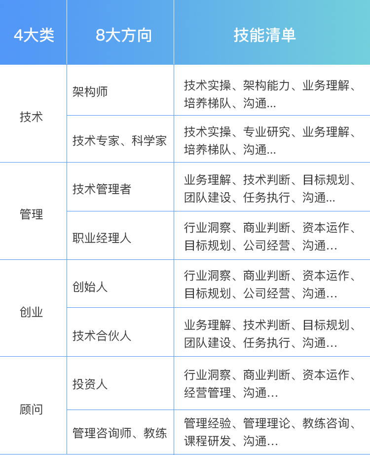
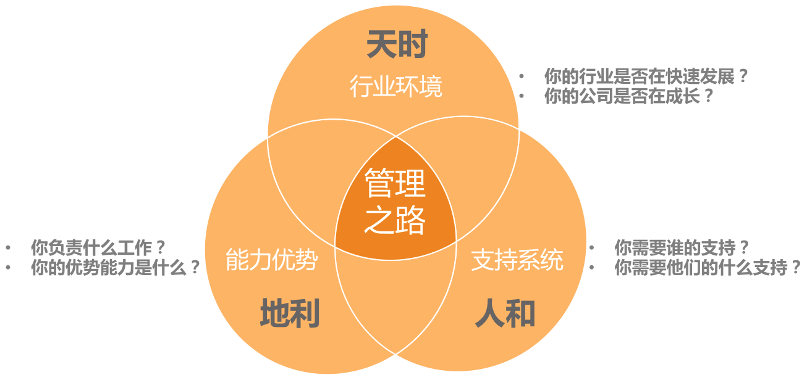
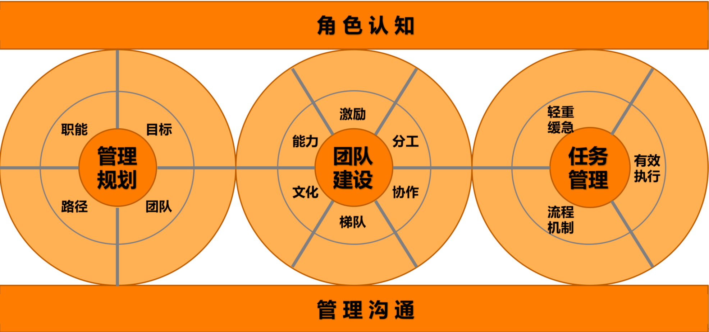

# 36讲

## 目录

-   [自我倾听（1-7）](#自我倾听1-7)
    -   [1、多年前的那些工程师都去哪了？](#1多年前的那些工程师都去哪了)
    -   [2、我要不要做管理呢？内心好纠结！](#2我要不要做管理呢内心好纠结)
    -   [3、哪些人比较容易走上管理岗位？](#3哪些人比较容易走上管理岗位)
    -   [4、 我要不要转回去做技术呢？](#4-我要不要转回去做技术呢)
    -   [5、作为技术管理者，我如何保持技术判断力？](#5作为技术管理者我如何保持技术判断力)
    -   [6、我这样的风格能做管理吗？](#6我这样的风格能做管理吗)
    -   [7、我能做好管理吗，大家服我吗？、](#7我能做好管理吗大家服我吗)
-   [角色认知(8\~10)](#角色认知810)
    -   [8、管理到底都做哪些事儿？](#8管理到底都做哪些事儿)
    -   [9、从工程师到管理者，角色都发生了哪些变化？](#9从工程师到管理者角色都发生了哪些变化)
    -   [10、新经理常踩的坑儿有哪些？](#10新经理常踩的坑儿有哪些)
-   [管理规划(11\~15)](#管理规划1115)
    -   [11、我刚开始带团队，从哪里着手呢？](#11我刚开始带团队从哪里着手呢)
    -   [12、如何界定我团队是干什么的呢？](#12如何界定我团队是干什么的呢)
    -   [13、如何为团队设定合理的目标呢？](#13如何为团队设定合理的目标呢)
    -   [14、如何来规划团队的组织结构呢？](#14如何来规划团队的组织结构呢)
    -   [15、都要申请哪些资源呢？](#15都要申请哪些资源呢)
-   [团队建设（16\~24）](#团队建设1624)
    -   [16、 团队建设该从哪里入手？](#16-团队建设该从哪里入手)
    -   [17、如何提升员工的个人能力？](#17如何提升员工的个人能力)
    -   [18、 如何提升员工的工作意愿和积极性？](#18-如何提升员工的工作意愿和积极性)

### 自我倾听（1-7）

#### 1、多年前的那些工程师都去哪了？

#### 2、我要不要做管理呢？内心好纠结！

以下四类说法是最为常见的：

**第一类：不得已的选择**。典型说法有：

-   “我对技术没有热情，也没有技术特长，所以只能做管理。”
-   “做技术又不能做一辈子，很多前辈都转管理了，我也要转。”
-   “没有办法，公司发展太快了，老板要求我带团队。

**第二类：别人眼里的成功**。典型说法有：

-   “如果能做到公司高管，别人都会认为我是一个优秀和成功的人。”
-   “能够做管理带团队，这样在家人眼中会很风光。”

**第三类：不辜负组织的期待**。典型说法有：

-   “上级说我适合做管理，我不能辜负他对我的期望。”
-   “公司需要我带团队，这是公司对我的信任，我一定得做好。”

**第四类：对做管理的主观遐想**。典型说法有：

-   “不用凡事亲力亲为，安排下级去做就好了，应该会轻松些。”
-   “做管理越晋升越轻松，你看高管都不坐班。”

第一个重要问题是关于“管理的价值观”的，即你是否认同管理的价值呢？

第二个重要的问题是，你是否对管理充满热情，并享受这些工作呢？

第三个重要问题是，你是否看重在管理方面的成长呢？

1. 更大的责任。

2. 更立体的视角。

3. 更灵活的思维方式。

收获

首先，你到了一个更大的平台上，你的能力和视野将得到大幅度提升。这会给你带来明显的成长感。 &#x20;

其次，你不但能力变强了，你还有团队了，你能搞定更大、更复杂的事情，做出更大的成绩。这会带给你更强的成就感。

再次，你可以带着团队做出越来越多的成就，你的团队也越来越优秀，团队成员都得到了成长，你甚至还会影响到合作团队。你的影响力显著提升了。

最后，你的能力、成绩、影响力全面提升，你得到了更多的精神和物质的回报。你所有的付出、成长和积累，都将或早或晚地换回等值的回馈。你的获得感也将得到满足

#### 3、哪些人比较容易走上管理岗位？

-   **天时：** 做管理的“天时”，其实就是机会、时机、大环境、时代背景。
-   **地利：** 做管理的“地利”，就是你的优势、能力，以及你所负责的工作内容。
    -   第一类是负责最全局的模块，核心是“广”。
    -   第二类是负责最核心的技术模块，核心是“深”。
-   **人和：** 做管理的“人和”，就是你能否得到他人的支持。
    -   第一类，为你提供机会、平台和资源的支持。一般是你的上级
    -   第二类，为你提供陪伴和共同成长的支持。一般是和你平级的管理者
    -   第三类，为你提供指导和前进的方向。一般是你的导师、指导人、管理教练或上级
    -   第四类，为你提供情感支持，让你勇于面对困难和挫折，一般来说，是你的家人和朋友
        

#### 4、 我要不要转回去做技术呢？

**问题：**

-   **转管理之前没有仔细了解过管理。**
-   **才开始做管理，还无法靠管理“安身立命”**。
-   **认为技术才是自己的“大本营”**。

**解决：**

第一个药方，专门针对“患失”来开。

首先，把技术提到更高视角来看待。

其次，换一种学习方式来掌握技术。

1.  建立你的学习机制。
2.  请教专家。
3.  共创。

最后，关于“患失”，还有一个视角，如果你是真心热爱技术，擅长用技术的思路和方案解决问题，你可以做技术型管理者。

第二个药方，专门针对“患得”开出。

首先，做管理对个人成长和个人发展来说，不会失败。

其次，一线技术管理者，即便“做不好”也并非没有“回头路”。

最后，做管理所积累的能力，完全可以迁移到做“技术带头人”或“技术 leader”这个角色上。

第三个药方，有点猛，叫做“认清现实”，做技术升维。

首先，从目标出发去看待技术。

其次，从评估的角度去看待技术。

最后，从借助自己的技术到借助大家的技术。

#### 5、作为技术管理者，我如何保持技术判断力？

如果说带团队做项目就像组装一部手机，你会越来越清楚如何把各个组件集成起来，但是你不见得会清楚每一个电子元器件内部的技术实现。

评估方法论

-   第一个维度是结果评估

    你要回答“要不要做”，希望拿到什么结果
-   第二个维度是可行性评估。
    -   一是“能不能做”
    -   二是“值不值得”
        -   首先是“人财物时”等资源投入成本
        -   其次是维护成本
        -   技术选型成本。
        -   技术升级成本。
        -   问题排查成本。
        -   代码维护成本。
        -   再次是机会成本
        -   最后是协作成本
-   第三个评估维度，即风险评估。
    -   提升自己的技术判断力
        1.  建立技术学习机制
            1.  盘点你负责的业务，需要哪些方面的技术，成立一个或几个核心的技术小组，让团队对各个方向的技术保持敏感，要求小组定期做交流和分享，这样你就可以保持技术的敏感度。
        2.  专项技术调研项目化
            1.  如果某项技术对团队的业务有重要的价值，可以专门立项做技术调研，并要求项目负责人做调研汇报。
        3.  和技术大牛交流
            1.  越是厉害的技术人，越能深入浅出地把技术讲明白，所以针对某项技术找大牛取经，也是学习的好途径。你看，虽然实际操刀的时间少了，但是你和技术大牛的交流机会多了，一方面因为你有更大的影响力了，另一方面，你和大牛有了共同的诉求，就是把技术“变现”，让技术产生价值。
        4.  听取工作汇报
            1.  因为你带的是技术团队，大部分工作都和技术相关，在读员工的周报、季度汇报时，相互探讨，也是一种切磋和学习。

#### 6、我这样的风格能做管理吗？

**管理风格，本质就是你和团队的协作方式，也就是你和团队的“位置关系”，即你站在团队的什么位置**。如果还是难以想象，你可以把带团队，看作是在驾驭一辆马车，你和这几匹马是如何协作，一起把车拉到目的地呢？

\*\* 第一类是发号施令型。\*\* ​

-   重事不重人，关注目标和结果，喜欢发号施令但不亲力亲为。
    -   特点：一位坐在马车上驾驶车辆的车夫，他不参与拉车，但是马匹的一举一动，都听命于他的指令，通常团队执行力很强，但是梯队很难培养起来。

**第二类是以身作则型。**

-   重人不重事，希望带头冲锋亲力亲为，特别在意团队成员的感受，并替他们分担工作。
    -   特点：以身作则的管理者凡事冲在最前面，是站在马匹中间，和大家一起奋力拉车的人。带不了大规模团队。

**第三类是激发辅导型。**

-   重人也重事，关注全局和方向，并在做事上给予教练式辅导和启发。
    -   特点：不会去替马拉车，但是会陪着马一起赶路，同时辅导马匹怎么样能够把路走好，以及要往哪里走。管理者团队做事，个人成长是最显著的，团队梯队也能快速完善起来。但是由于这类风格对于管理者精力消耗比较大，很难覆盖到全体成员，所以比较适用于核心梯队的培养。
    -   这有点像球场上的教练，他们不上场，但会把握比赛节奏和方向，不断给球员提供指导和反馈。所以我们把这类管理风格称为**教练式管理**。

**第四类是无为而治型。**

-   不重人也不重事，关注目标和结果，不关心过程和人员发展。
    -   特点：管理者对团队成员做事表现得非常放心，甚至让大家感觉有点漠不关心；对任务执行过程不关心，关心的只是他最在乎的目标和结果。在这类管理者团队中做事，对于不成熟的团队，成员就会变成野蛮生长；而对于成熟的团队，成员就会有很好的发挥空间和舞台，反而会得心应手

三国的故事，中国人都耳熟能详，其中有一段叫“刘备入川”：刘备在落凤坡损失军师庞统之后，就调集荆州的诸葛亮来支援西川，这时诸葛亮就需要把守卫荆州的重担交给刘备的二弟关羽。那他将会怎么样嘱托关羽呢？

我们来看看四类不同风格的诸葛亮，会如何对关羽说呢？

**指令式**的诸葛亮会说：“我把荆州托付给你，你对曹操要采取抵抗的策略，而对东吴一定要采取联合的策略，你一定要照我说的做，否则荆州肯定会丢。”

**支持式**的诸葛亮会说：“兄弟，我去支援主公，没法和你一起守荆州了，但是有什么问题你随时告诉我，我全力支持！”

**教练式**的诸葛亮会说：“云长，荆州这个重担就交给你了，如果曹操来打荆州，你打算怎么应对呢？如果曹操和孙权一起来打，你又会怎么应对呢？”听完关羽的方案，教练式的诸葛亮会给出自己的建议：“你这么做荆州比较危险，你可以参考我的策略：北拒曹操，东和孙权。”

**授权式**的诸葛亮会说：“云长，荆州就交给你了，你要确保万无一失，我相信你一定能搞定！”

当一项工作不容有闪失，而你又是唯一熟悉、且最有掌控力的人时，一个命令式的你可能更能降低风险、达成目标。所以，命令式管理最适用于需要强执行的场景。

当一个团队特别需要凝聚力和斗志，需要攻坚的时候，一个支持式的你会促成很好的效果。所以，支持式管理特别能带团队士气和凝聚力，在带动大家热情和积极性方面很有优势。

当有一些核心人才需要重点培养，团队需要发展梯队的时候，一个教练式的你会带来明显的效果。他们不但能把事情做好，个人能力还能成长。虽然执行速度通常不会太快，但是不会偏离方向。

当团队梯队很成熟，团队成员需要发挥空间的时候，一个授权式的你能提供最恰当的管理方式。

#### 7、我能做好管理吗，大家服我吗？、

不自信的问题：

第一，管理经验不足和能力欠缺。

能力分为三个层次：知识、技能和才干，做迁移

你可以通过梳理自己可迁移的能力，提升能力自信；

第二，和团队成员对立比较。

你可以通过把自己从团队成员的对立面抽离，提升角色自信；

第三，背负着沉重的包袱。

你可以通过收集外部积极正向的反馈，提升自我认同。

**“你也许不是那个最强的人，但是你得相信，你是此时此刻做这事儿最合适的人。”**

### 角色认知(8\~10)

#### 8、管理到底都做哪些事儿？

管理主要：带人，做事，看方向。

#### 9、从工程师到管理者，角色都发生了哪些变化？

#### 10、新经理常踩的坑儿有哪些？

**过程导向、被动执行**

1.  团队方向感缺失。大家都只是着眼于手头工作，团队得不到愿景的凝聚和激励。 &#x20;
2.  团队做不出有效的业绩。因为团队没有方向感，所以结果就很难有效。 &#x20;
3.  无法带领一个团队。由于视角局限，所以还不具备带领团队的能力。

**大包大揽、唯我最强**

1.  梯队问题：大树底下寸草不生，梯队迟迟培养不起来。因为梯队的培养需要授权，需要让高潜人才有发挥空间并承担相应的责任 &#x20;
2.  激励问题：由于管理者冲得太靠前，团队成员积极性受挫，遇事往后缩。 &#x20;
3.  个人发展问题：由于得不到团队成员的有效支持，自己又忙又累，做不了更大的业务。

**带头大哥、当家保姆**

1.  不职业的管理风格和文化，这会给公司带来很大的潜在风险。 &#x20;
2.  团队没有方向，所以很难有正确的判断和决策。

**单一视角、固化思维**

1.  习惯性卡住。遇到问题和困难，很容易被卡住，到处都是绕不过去的鸿沟。 &#x20;
2.  认知层次低。由于被单一惯性思维所支配，认知层次和考虑问题的维度无法提升。 &#x20;
3.  难堪重任。由于创造性地解决问题的能力不足，难以承担具有挑战性的工作。

**自扫门前雪、固守边界**

1.  项目推进不畅，从而影响全局的结果。
2.  自我设限，因此个人成长受限。
3.  个人影响力无法扩展。因为目光和手脚都局限在团队内，所以无法在更大的范围产生影响力，也就无法成为更高级的管理者。

**患得患失**

1.  犹豫反复，无法全力以赴去做好管理，成长缓慢。
2.  对技术的看法太狭隘，从而影响技术判断力的提升。
3.  由于误判，可能会错失一个好的发展平台。

### 管理规划(11\~15)

#### 11、我刚开始带团队，从哪里着手呢？

**思维**

-   问题驱动型思维：期待着解决掉这些问题之后，事情就都好了
-   规划驱动型思维：通过理清未来的发展来理顺当前问题的带团队思路

**规划四要素**

职能：这是辆什么车

-   弄清楚它是一个背负着什么样职责和使命的团队，决定了你需要设定什么样的工作目标，并通过哪些要素来衡量你的目标；
-   决定了你需要什么样的人加入你的团队，以及需要多少；
-   还决定了你选择什么样手段，投入什么样的资源来完成工作。

目标：你要把这辆车拉到哪里去

-   首先，清晰明确的目标可以凝聚团队成员的力量，让大家劲往一处使，提升团队凝聚力； &#x20;
-   其次，清晰的目标还是执行力的必要要素，你可以回想团队取得的每一个执行出色的项目，目标一定是非常清晰； &#x20;
-   再次，清晰的目标还能提升判断力，如果你能够对某个突发状况快速决策，你一定非常清晰你当时想要的是什么； &#x20;
-   &#x20;最后，清晰的目标本身就是激励，当员工很清楚自己的工作目标，方向感很清晰的时候，他们更容易进入心流状态，即，一种投入度非常高，沉浸其中、物我两忘的工作状态。

团队：盘点一下你有哪些马，它们情况如何

-   如何升级完善自己的团队
-   思考在达成目标之后你期待收获一个什么样的团队

路径：你选择走哪条路

-   看看有哪些路可以走
-   不同的选择，各自需要多少资源预算

#### 12、如何界定我团队是干什么的呢？

**三个问题**

1.  公司为什么要给我这批资源（指这个团队）？是希望我产出什么？ &#x20;
2.  这个团队存在的独特价值是什么？ &#x20;
3.  你用什么维度来衡量团队的价值高低？

**团队职能**

两个层次

-   基本的职责

    职责，是团队职能的下限，即，至少要完成的工作，如果这些职责都搞不定，意味着团队的基本价值都不能体现。

    升华的使命

    使命，是团队职能的上限，即，如果我们团队做得好，就能承担更大的职责，体现出更大的价值。

    基本职责解决的是“团队生存”问题，而使命解决的是“团队幸福”问题。

**设定团队职责和使命的方法和步骤**

第一步，收集信息。

1.  向上沟通。听听上级对你团队的期待和要求，以及希望用什么维度来衡量你做得好还是不好。
2.  向下沟通。主要是和大家探讨对团队业务的看法和理解，以及对未来发展的期待，为以后的沟通做好铺垫。
3.  左看右看。主要是看职能定位的边界在哪里，最好和兄弟团队的职能是无缝对接的。
4.  你的理解。即，你对业务的理解，你对领域的理解，你对团队的期待，以及你对自己的期待。

第二步，提炼和升华。

1.  职责的提炼。基于上级的期待和要求，以及你对业务核心价值的理解，最好用上级和团队成员、兄弟部门都易于理解的语言，对职责进行简短化提炼，并尽可能长时间稳定下来。
2.  使命的升华。基于基本职责，寻找团队对于部门和公司的独特价值，并和行业发展趋势结合，设定自己的期待。
3.  确定衡量维度。一般来说，团队的职责和使命决定了衡量的维度，但是如果有明确的关于衡量维度的说法，会让员工对职责和使命有更深刻的理解。

第三步，确认和主张。

1.  确认主要是和自己的上级确认，得到上级的认同和支持
2.  主张

    2.1 在合适的场合，比如季度会、合作沟通会等，有计划、有步骤地把团队的职责和使命宣贯给大家

    2.2 团队职能的设定和宣贯是一个长期工程，不要期待一蹴而就。

#### 13、如何为团队设定合理的目标呢？

&#x20;**结果**

1.  第一，你会更加清楚目标都意味着什么，它可不是让团队有事儿干那么简单。&#x20;
2.  第二，你会掌握目标设定的要点，即使你之前没做过目标管理，你也可以实际操作了。&#x20;
3.  第三，一起探讨在团队频繁调整，公司战略都不稳定的情况下，如何管理团队目标。

**目标的意义**

1.  第一，最基本的，目标包含着你和上级的诉求，即，你们希望收获的东西。
2.  第二，目标意味着资源的有效配置。明确的目标可以让你把资源投注在有效的方向上，从“该做什么”去调配资源。
3.  第三，目标意味着执行力。
4.  第四，目标意味着凝聚力。明确的团队目标和愿景，就是提升团队凝聚力的重要手段之一。
5.  第五，目标也意味着激励。团队目标感带给员工对工作的意义感和使命感，也是提升自驱力的重要来源。

**评判一个目标是否合理：“SMART”原则**

明确性（Specific）：把目标设定到可以衡量的程度

可衡量性（Measurable）：有量

可达性（Attainable）：能不能做到

相关性（Relevant）：工作内容必定是和上、下游及上级目标相关联的

时限性（Relevant）：所有的目标都是基于一定时限的，截止时间。

**目标的描述形式**

KPI：到某时间点，什么指标达到什么数字；

KRA/OKR：到某时间点，完成什么工作，该工作实现了哪些功能或达到了哪些效果。

**坑**

1.第一类问题是基于现有资源做目标，而不是基于远方的目标往前推。

-   面对这类问题和挑战的钥匙叫做“以终为始的出发点”。

1.  第二类问题是目标不明确。

-   交代做完这些工作后，“取得了什么效果”。 因此，面对这类问题和挑战的钥匙叫做“结果导向的描述”

1.  第三类问题是目标设定好之后，自己和自己的上级都很清楚了，但是没有刻意地向团队成员来传达

-   面对这类问题和挑战的钥匙叫做“目标的向下同步”。

1.  第四类问题，就是目标总是被迫变来变去(业务目标)。

    &#x20;面对这类问题和挑战的钥匙叫做“设定专业目标”，用专业目标来增强团队的内在定力。
    1.  业务目标：简单来说就是需要完成的业务业绩目标，也就是我们常说的 KPI 和 KRA，是公司和上级对你团队的业绩要求，这类目标一般是自上而下拆解下来的，所以来自于外部，一般不容易被忽略。
    2.  专业目标：来自你团队的内在要求，一般是由你和团队自己设定的，属于自我要求，所以新的管理者往往会忽略不做，有的是想不到，有的是懒得做。而恰恰是这个内在目标的设定，最能体现你的管理价值，因为这是最能展示你的自主性的地方。
        **专业目标设定的核心步骤就两步：**
    -   选择你要提升的关键维度；
    -   设定目标，可以是量化的 KPI，也可以是非量化的 KRA。

-   例如：设置专业目标：服务端团队的稳定性和性能，半年内提升 40% 的并发性能，数据团队的准确性和安全性，功能迭代团队的高效和质量，等等，这些维度是最能体现团队核心能力及价值的。

**问题：** 内在的专业目标还没有达成的时候，上级的业务目标又压下来了怎么办？这类冲突的处理办法和“重要紧急”四象限的权衡思路是一致的，**内在的专业目标属于重要的事情，而外部压过来的目标，属于紧急的事情**。

**四象限法则：**

#### 14、如何来规划团队的组织结构呢？

1.  **根据团队目标的设定去梳理团队**

-   首先是团队的规模。也就是你团队有多少人，这其中要理清楚有多少人是现有的，有多少人是接下来要新增的，加起来就是你规划的团队总规模。
-   其次是团队的分工。即，你的团队都负责哪些业务，每个业务配置了多少人力，以及这些人员都如何分工，人力分布和业务目标是否匹配等。
-   最后是团队的梯队。一个团队的梯队情况代表了团队的成熟度和复原力。

1.  **从资源角度来审视团队**

-   取决于你对业务的理解，以及你希望达成的目标。
-   可以参照行业资源配比情况。

1.  **从人才培养角度来看梯队规划**

-   到下一个时间节点，你需要重点培养出哪些人，给他们什么样的平台和空间，以及你有能力提供给他们什么指导和支持，期待他们能够胜任什么职能和角色
-   团队消化能力
    -   看看你团队都有谁能带人，分别带几个比较合理。
    -   看看你团队的新人培养机制是否成熟健全。

要给上级提交一份规划报告，关于团队部分，你应该以什么形式来呈现呢？

**第一部分，绘制一张组织结构图**。这张图需要体现我前面提到的团队状态三要素：

-   **规模**，包括当前人数、预算人数和总人数。
-   **分工**，体现团队人力都分布在哪些业务上，以及各个业务都由谁来负责。
-   **梯队**，包括团队的级别和梯队分布情况。

**第二部分，列出整个团队的资源盘点情况。大体是这样的：**

-   A 级别：x 人，其中当前 m 人，预算新增 n 人；
-   B 级别：y 人，其中当前 m 人，预算新增 n 人；
-   C 级别：z 人，其中当前 m 人，预算新增 n 人；
-   ……

**第三，列出重点培养对象，以及负责业务。大体是这样的：**

-   张三，XX 业务核心工程师，到年底能完全负责 XX 业务，并能带新人；
-   李四，YY 业务负责人，到年底能带 n 人独立负责 YY 业务；
-   ……

#### 15、都要申请哪些资源呢？

**第一个问题，你是否了解资源的丰富性呢？**

-   人、财、物
-   时间
-   信息
-   权限

**第二个问题，你是否意识到手段的多样性呢？**

**第三个问题，即人力资源的持续性。通俗说就是，不是所有的人力短缺，都要通过招聘来解决。**

### 团队建设（16\~24）

#### 16、 团队建设该从哪里入手？

#### 17、如何提升员工的个人能力？

**提升团队战斗力的基础和前提，是提升员工的个体能力**

能力三核：知识、技能和才干三个层次。

大部分管理者希望员工提升的能力，是在“技能”这个层次，也就是员工能操作和完成的技术，比如快速学习能力、进度控制能力等。

**1、定义你所谓的员工能力；**

工作能力：人格力量、专业能力、通用能力

-   **人格力量**通常是指一个人在面对某一情形时稳定的态度和表现，比如迎难而上、坚持不懈、积极正向、主动担当等等。
-   **专业能力**很容易理解，对于技术人来说，一般就是指技术能力。
-   **通用能力**，每个人都会常常提起，但是很少有人能说清楚哪些能力算是通用能力。

**2、设计出一些可行的方法；**

-   第一类，关于帮助员工自学
    -   组织员工参加培训； &#x20;
    -   为员工推荐和购买书籍； &#x20;
    -   提供学习文档、视频等；
-   第二类，关于相互交流讨论。
    -   组织兴趣小组、读书会等； &#x20;
    -   技术分享交流会、代码评审会等； &#x20;
    -   重点工作复盘，即 case study 等；
-   第三类，关于工作实践。
    -   授权和辅导。给员工独立负责重要工作的机会，并给予辅导和反馈。 &#x20;
    -   调研工作项目化。即把调研学习的工作进行项目化管理。 &#x20;
    -   总结并内化。对于员工完成的重要工作，有必要请他们做一个工作总结，看看从中学到了什么。

对于提升员工个人能力来说，**最关键的往往不是学习的方法，而是学习的意愿**。

**3、激发员工的学习动力。**

你应该如何激发员工学习的动力和意愿呢？

-   “推”，就是给压力，推着他们学
    1.  提出明确的工作要求。比如，在 1 周内熟悉某个业务并可以做开发。 &#x20;
    2.  设置学习机制。也就是强制要求遵守学习规则，并完成学习任务。 &#x20;
    3.  peer pressure。团队整体学习成长的氛围，会给不学习的员工带来压力。 &#x20;
    4.  惩罚。包括从绩效等级、晋升机会、调薪幅度等等，对于学习意愿低的员工有适当的“关照”。
-   “拉”，就是给方向，引导他们学
    1.  树立榜样。把特别有学习意愿和成长快速的员工设为标杆人物，在团队内给予认可和奖励。
    2.  配备导师。有明确导师的新人和员工，更愿意请教问题并快速融入团队。也许有的管理者会说，“我们团队氛围很好，新人来了随便问谁都可以。”而事实上，有名义上的导师，比没有指明导师要好很多，“找谁都行”，即意味着没有人对此负责。所以，请为你团队成员配备导师，新人导师最好是团队内的，而资深员工的导师，可以找团队外更资深的人。
    3.  给地图。成熟的公司往往会有技术方面的“技能图”，作为管理者，你也可以为自己团队制定一个成长的“技能图”，并标记出重要等级。这样，团队成员就有了学习和成长的方向，知道该往哪里使劲了。
-   “放手”，就是给发挥空间，让他们自主学习。
    1.  给员工勇挑重担的机会，在风险可控的情况下，给员工承担责任的机会，让他们去负责一些有挑战的工作。。
    2.  给员工自主空间，让他们独立思考，独立决策。你的辅导仅限于在他们的决策之后给出看法和建议。
    3.  给员工信心和耐心，允许他们犯错、走弯路。因为很多经验都是踩坑儿踩出来的，所以不能一出问题就劈头盖脸一顿批，甚至是剥夺其做事的机会。

关于提升员工的能力，有两个信念特别重要.

第一是相信员工能力的差异性。

即看到差异，重视丰富性。要特别关注能力的丰富性，标准不能太单一。

第二是相信团队能力的系统性。

即欣赏差异，重视互补性。**所谓完美的团队，就是价值观相同，优势互补的团队**。所以，作为管理者，你要看到团队能力的系统性，不要把各个员工的能力割裂来看。

#### 18、 如何提升员工的工作意愿和积极性？
